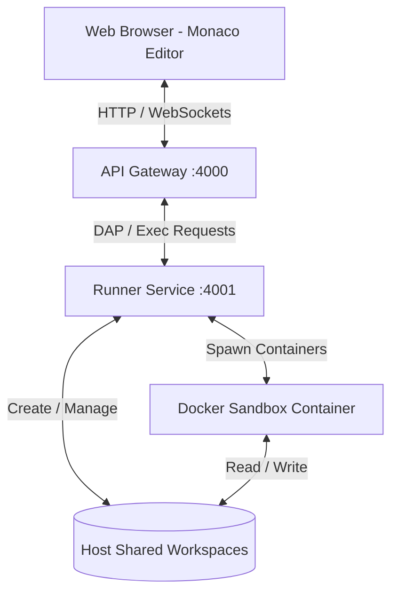

# ⚡ Internal Online Code Runner MVP

<p align="center">
  <strong>🌐 English</strong> &nbsp;·&nbsp; <a href="README.vi.md">Tiếng Việt</a>
</p>

A high-performance internal code runner with visual debugging for C, C++, and Python — built on the Debug Adapter Protocol (DAP) and isolated inside a secure Tailnet.

<p align="center">
  
  
  
</p>

<p align="center">
  
  
  
</p>

---

## 🛠️ Feature Matrix & Security Boundary

The run-and-debug experience is built on strict security and performance principles:

| Feature | Description | Security marker |
|---|---|---|
| 🔒 **Zero Server Persistence** | No database, no login, no long-lived server-side source. Source/stdin/argv exist only transiently in each job's workspace and are cleaned up after the job ends; they are also redacted from logs. | **No DB · No login** |
| 🚀 **Multi-Language Runner** | Compiles and runs C `gnu17`, C++ `gnu++20`, and Python 3.12. | **GCC / Python 3.12** |
| 🔍 **DAP-Bridged Debugging** | Real-time interactive debugging via GDB (C/C++) and debugpy (Python), bridged straight into the Monaco editor over the Debug Adapter Protocol. | **GDB / debugpy / GDB-MI** |
| 🛡️ **Docker Sandbox Isolation** | Fully isolated execution: no outbound network access, with strict CPU, memory, run-time, and output limits. | **CapDrop / PidsLimit** |
| 👁️ **Metadata-Only Logging** | Privacy by default: only performance metadata is stored. Source, stdin, and output are dropped. | **No code/stdout stored** |

---

## 🔐 Security Model & Disclaimer

> [!WARNING]
> This tool **executes arbitrary code** (C/C++/Python). Each job runs in a hardened Docker sandbox (`NetworkDisabled`, `CapDrop: ALL`, `ReadonlyRootfs`, `no-new-privileges`, CPU/RAM/PID/time/output limits), but a sandbox only **mitigates** risk — it does not eliminate it.

* **No authentication, no rate limiting.** There is no login and no throttling — anyone who can reach the endpoint can run code.
* **For trusted environments.** Designed to run **inside a private tailnet**. Do **not** place it directly on the public internet without adding your own authentication + rate limiting (reverse proxy / API gateway / Tailscale identity).
* **Self-host at your own risk.** If you fork or deploy this, you are responsible for your own infrastructure security. The software is provided "AS IS", without warranty — see [LICENSE](LICENSE).
* **Log privacy.** Source / stdin / argv are redacted from logs; only performance metadata is kept.

---

## 📐 System Architecture

The execution flow of the system:



---

## 🚀 Local Development

Run the following on your local machine to start the full development environment:

```bash
npm install
npm run dev
```

* **Frontend:** `http://localhost:5173`
* **API:** `http://localhost:4000`
* **Runner:** `http://localhost:4001`

> [!IMPORTANT]
> Docker is required to build the runner images used as isolated sandboxes:
> ```bash
> docker compose --profile runner-images build runner-cpp-image runner-python-image
> ```

---

## 📦 Ubuntu / Tailscale Deployment

Production deployment on an Ubuntu host with Tailscale installed:

| Step | Command | Description |
|---|---|---|
| **1. Build Images** | `docker compose --profile runner-images build runner-cpp-image runner-python-image` | Build the isolated GCC/Python sandbox images. |
| **2. Run Services** | `docker compose up --build -d frontend api runner` | Start the app services in detached mode. |
| **3. Tailnet Access** | Expose `http://<tailscale-ip>:8080` | Tailnet only. Do not expose to the public internet without auth. |
| **4. Shared Space** | Mounts `/tmp/gdb-ubuntu-runner-workspaces` | Temporary file-exchange area for child containers. |

---

## 🤖 Server Update Helper

Deployment auto-syncs on every push to `main` via a self-hosted GitHub Actions runner. The helper script can also be run manually:

| Update scenario | Command | Scope |
|---|---|---|
| **Code only** | `bash bin/pull-latest.sh` | Pull the latest code onto the host. |
| **Restart the app** | `RESTART_APP=1 bash bin/pull-latest.sh` | Rebuild & restart the app containers. |
| **Sandbox Dockerfile changed** | `REBUILD_RUNNER_IMAGES=1 RESTART_APP=1 bash bin/pull-latest.sh` | Rebuild the sandbox images + app. |

---

## 📊 Logs & Observability

Inspect service logs for debugging and monitoring:

### All services (follow)
```bash
docker compose logs -f frontend api runner
```

### A single service
```bash
docker compose logs -f runner  # or api / frontend
```

### HTTP traffic (Nginx access logs)
The `frontend` service is Nginx; its access log is written to the container's stdout, so it shows up in `docker compose logs`. Use these filters to view only real HTTP requests:

* **All HTTP access:**
  ```bash
  docker compose logs -f frontend | grep -E '"(GET|POST|PUT|DELETE|HEAD) '
  ```
* **Last 200 lines:**
  ```bash
  docker compose logs --tail=200 frontend | grep -E '"(GET|POST|PUT|DELETE|HEAD) '
  ```

---

## 🧪 Verification Suite

Run the integration test suite to confirm the system is stable before shipping:

```bash
npm run typecheck
npm test
RUN_DOCKER_TESTS=1 npm test -- apps/runner/src/dockerRunner.integration.test.ts
RUN_DOCKER_TESTS=1 npm test -- apps/runner/src/dapDebugSession.integration.test.ts
npm run e2e
```
