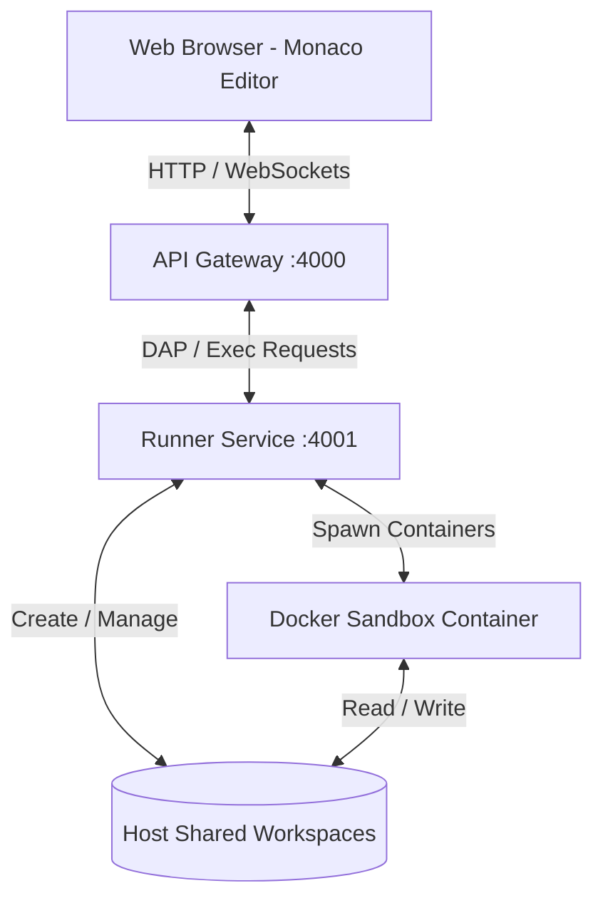

# ⚡ Internal Online Code Runner MVP

<p align="center">
  <a href="README.md"> English</a> &nbsp;·&nbsp; <strong> Tiếng Việt</strong>
</p>

Một nền tảng chạy code nội bộ hiệu năng cao và gỡ lỗi trực quan dành cho C, C++ và Python tích hợp giao thức DAP chuyên nghiệp trong môi trường bảo mật Tailnet.

<p align="center">
  
  
  
</p>

<p align="center">
  
  
  
</p>

---

## 🛠️ Feature Matrix & Security Boundary

Giao diện chạy code và gỡ lỗi của chúng tôi được thiết kế dựa trên các nguyên tắc bảo mật và hiệu năng nghiêm ngặt:

| Tính năng | Mô tả chi tiết | Chỉ số bảo mật |
|---|---|---|
| 🔒 **Zero Server Persistence** | Không database, không đăng nhập, không lưu mã nguồn lâu dài phía server. Source/stdin/argv chỉ tồn tại tạm trong workspace của mỗi job và được dọn dẹp sau khi job kết thúc; chúng cũng bị redact khỏi log. | **No DB · No login** |
| 🚀 **Multi-Language Runner** | Hỗ trợ biên dịch và thực thi C `gnu17`, C++ `gnu++20`, Python 3.12. | **GCC / Python 3.12** |
| 🔍 **DAP-Bridged Debugging** | Gỡ lỗi tương tác thời gian thực thông qua GDB (C/C++) và debugpy (Python) được bắc cầu trực tiếp vào trình soạn thảo Monaco qua giao thức DAP. | **GDB / debugpy / GDB-MI** |
| 🛡️ **Docker Sandbox Isolation** | Môi trường thực thi cô lập hoàn toàn: không có quyền truy cập mạng ngoài, giới hạn nghiêm ngặt về CPU, dung lượng RAM, thời gian chạy và đầu ra. | **CapDrop / PidsLimit** |
| 👁️ **Metadata-Only Logging** | Quyền riêng tư tuyệt đối: Chỉ lưu các siêu dữ liệu hiệu năng (metadata). Toàn bộ mã nguồn, dữ liệu đầu vào (stdin) và kết quả đầu ra đều được bỏ qua. | **Không lưu code/stdout** |

---

## 🔐 Security Model & Disclaimer

> [!WARNING]
> Đây là công cụ **thực thi code tùy ý** (C/C++/Python). Mỗi job chạy trong Docker sandbox bị siết chặt (`NetworkDisabled`, `CapDrop: ALL`, `ReadonlyRootfs`, `no-new-privileges`, giới hạn CPU/RAM/PID/thời gian/output), nhưng sandbox chỉ **giảm thiểu** rủi ro chứ không loại bỏ tuyệt đối.

* **Không xác thực, không rate limit.** Hệ thống không có đăng nhập và không giới hạn tần suất — bất kỳ ai truy cập được endpoint đều có thể chạy code.
* **Dành cho môi trường tin cậy.** Được thiết kế để chạy **trong tailnet nội bộ**. **KHÔNG** đặt trực tiếp sau public internet nếu chưa tự bổ sung lớp xác thực + rate limit (reverse proxy / API gateway / Tailscale identity).
* **Tự host = tự chịu rủi ro.** Nếu bạn fork hoặc triển khai, bạn chịu trách nhiệm về bảo mật hạ tầng của mình. Phần mềm cung cấp "AS IS", không bảo hành — xem [LICENSE](LICENSE).
* **Quyền riêng tư log.** Source / stdin / argv bị redact khỏi log; chỉ lưu metadata hiệu năng.

---

## 📐 System Architecture

Dưới đây là sơ đồ luồng tương tác thực thi của hệ thống:



---

## 🚀 Local Development

Chạy các lệnh sau ở máy cục bộ để khởi động toàn bộ môi trường lập trình:

```bash
npm install
npm run dev
```

* **Frontend:** `http://localhost:5173`
* **API:** `http://localhost:4000`
* **Runner:** `http://localhost:4001`

> [!IMPORTANT]
> Yêu cầu Docker để build các runner-images dùng làm sandbox cô lập:
> ```bash
> docker compose --profile runner-images build runner-cpp-image runner-python-image
> ```

---

## 📦 Ubuntu / Tailscale Deployment

Quy trình triển khai môi trường sản xuất trên máy chủ Ubuntu có cài đặt Tailscale:

| Bước thực hiện | Lệnh thực thi | Mô tả chi tiết |
|---|---|---|
| **1. Build Images** | `docker compose --profile runner-images build runner-cpp-image runner-python-image` | Tạo các image sandbox chứa GCC/Python cô lập. |
| **2. Run Services** | `docker compose up --build -d frontend api runner` | Khởi động các dịch vụ nền ở chế độ detached. |
| **3. Tailnet Access** | Expose `http://<tailscale-ip>:8080` | Chỉ mở trong Tailnet. Không expose public internet nếu thiếu auth. |
| **4. Shared Space** | Mounts `/tmp/gdb-ubuntu-runner-workspaces` | Vùng đệm trao đổi file tạm thời cho các container con. |

---

## 🤖 Server Update Helper

Hệ thống tự động đồng bộ khi push lên nhánh `main` qua self-hosted GitHub Actions runner. Dưới đây là các lệnh chạy script bổ trợ thủ công:

| Tình huống cập nhật | Lệnh thực thi | Phạm vi tác động |
|---|---|---|
| **Chỉ cập nhật mã nguồn** | `bash bin/pull-latest.sh` | Kéo code mới về host. |
| **Khởi động lại ứng dụng** | `RESTART_APP=1 bash bin/pull-latest.sh` | Khởi động lại các container. |
| **Đổi Dockerfile sandbox** | `REBUILD_RUNNER_IMAGES=1 RESTART_APP=1 bash bin/pull-latest.sh` | Rebuild toàn bộ sandbox + ứng dụng. |

---

## 📊 Logs & Observability

Xem nhật ký hoạt động của các dịch vụ để gỡ lỗi và giám sát:

### Toàn bộ dịch vụ (Theo dõi liên tục)
```bash
docker compose logs -f frontend api runner
```

### Một dịch vụ cụ thể
```bash
docker compose logs -f runner  # Hoặc api / frontend
```

### Giám sát lưu lượng HTTP (Nginx access logs)
Dịch vụ `frontend` là Nginx; access log được ghi ra stdout của container nên hiển thị qua `docker compose logs`. Dùng các bộ lọc sau để xem riêng các request HTTP truy cập thực tế:

* **Tất cả các truy cập HTTP:**
  ```bash
  docker compose logs -f frontend | grep -E '"(GET|POST|PUT|DELETE|HEAD) '
  ```
* **Giới hạn 200 dòng gần nhất:**
  ```bash
  docker compose logs --tail=200 frontend | grep -E '"(GET|POST|PUT|DELETE|HEAD) '
  ```

---

## 🧪 Verification Suite

Chạy bộ test kiểm thử tích hợp để đảm bảo hệ thống hoạt động ổn định trước khi bàn giao:

```bash
npm run typecheck
npm test
RUN_DOCKER_TESTS=1 npm test -- apps/runner/src/dockerRunner.integration.test.ts
RUN_DOCKER_TESTS=1 npm test -- apps/runner/src/dapDebugSession.integration.test.ts
npm run e2e
```
